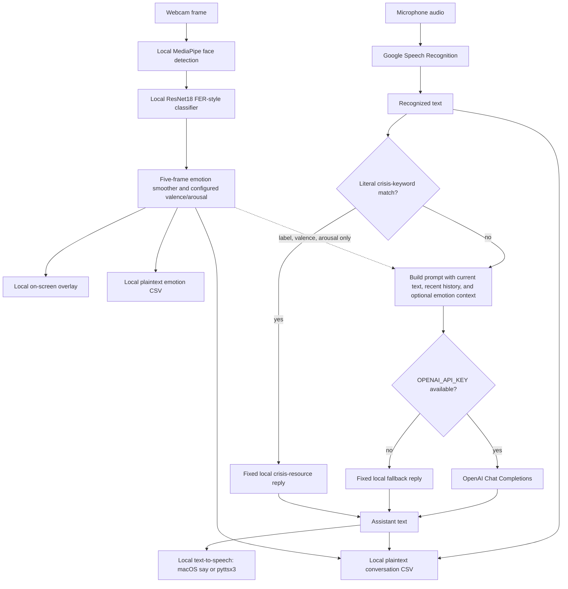
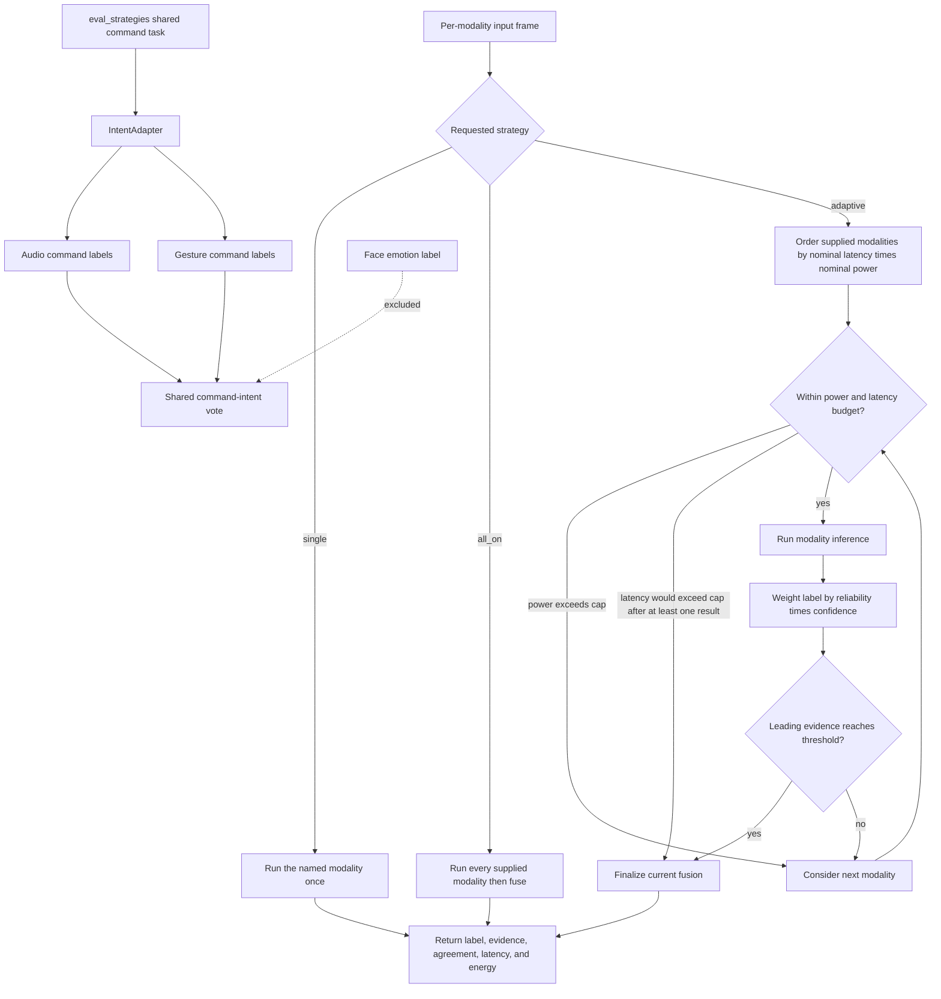

# NeuroBot architecture and data boundaries

This page describes implemented source paths and their current limits. It is not a model-performance report; see [results](results.md) for the evidence record.

## Companion flow

`src.demo_voice_session` supplies a three-second face-emotion burst for each voice turn. The raw webcam frame is processed locally and is not put into the OpenAI message list. When an emotion state exists, the message contains its label and configured valence/arousal context; recent conversation history is also included. If `OPENAI_API_KEY` is missing, or a cloud call raises an exception, `ConversationManager` returns a local fallback reply.

The keyword branch is deliberately limited. It checks a fixed, case-insensitive English substring list before the cloud path and returns a fixed, U.S.-centric resource message on a match. It can miss paraphrases, other languages, context, and urgency, and can also match without sufficient context.

## Adaptive sensing and command-intent boundary

`AdaptiveGate` supports `single`, `all_on`, and `adaptive` modes. In adaptive mode it orders the supplied modalities by configured nominal latency multiplied by nominal power, skips a modality above the power cap, avoids a predicted latency overrun after a result exists, and stops when winning evidence reaches the configured threshold. Fusion sums `reliability × confidence` per label, then reports the winning label, evidence, and agreement posterior.

The command-task evaluator in [`src/eval_strategies.py`](../src/eval_strategies.py) has a stricter boundary than the generic gate: `CLASS_TO_COMMAND` and `IntentAdapter` include only audio and gesture. Face emotion does **not** vote on command intent. If a face model is loaded there, it is used for cost profiling, not the intent gate. This is separate from the five-frame facial smoothing used by the companion path.

## Data boundary

| Data element | Local processing | External provider | Persisted artifact | Current protection or limitation |
| --- | --- | --- | --- | --- |
| Webcam frame | OpenCV capture, MediaPipe detection, face crop, ResNet inference, display | None in the shown companion path | None for raw frames in the shown path | Raw frames are not sent to OpenAI by this code. Camera access and bystander/participant handling are outside the implementation. |
| Inferred emotion label, confidence, configured valence/arousal | Five-frame smoothing and per-turn aggregation | OpenAI only when the optional cloud conversation path is used | `logs/sessions/session_<id>_emotion.csv`; an aggregate JSON report under `logs/reports/` | Files are plaintext CSV/JSON. The values are model outputs and configured mappings, not a person's confirmed internal state. |
| Microphone audio | Local capture and ambient-noise adjustment before transcription | Google Speech Recognition through `recognize_google` | No raw-audio file in the shown path | Audio leaves the device for transcription. The repository provides no provider retention control or consent mechanism. |
| Recognized text, recent conversation history, and optional emotion context | Literal keyword precheck; prompt construction; local fallback selection | OpenAI Chat Completions only when an API key is available and the precheck does not match | `conv_logs/session_<id>_conversation.csv` | Conversation logs are plaintext and contain user and assistant text plus emotion fields. The keyword check is a limited precheck, not a contextual assessment. |
| Assistant reply | Local fallback or cloud reply; local text-to-speech | OpenAI only on the configured cloud branch | Conversation CSV above | macOS uses `say`; other platforms use pyttsx3. No encryption, retention schedule, or access control is implemented for logs. |
| Benchmark dummy inputs | Local NumPy image, waveform, or frame-stack creation and model timing | None | Benchmark CSV selected by the run command, including [`results/latency_power.csv`](../results/latency_power.csv) | These are synthetic compute inputs. They do not establish task accuracy or user-data behavior. |
| Pre/post survey responses | Repository only links to the surveys | Duke Qualtrics links in the README | No survey client, export, or result file is committed | The linked surveys remain unchanged. Accessibility, consent, retention, and governance status are not established by this repository. |

## Implementation references

- [Companion voice session](../src/demo_voice_session.py), [conversation manager](../src/conversation_manager.py), [voice I/O](../src/voice_io.py), and [session logger](../src/session_logger.py)
- [Adaptive gate](../src/adaptive_gate.py), [strategy evaluator](../src/eval_strategies.py), and [modality base](../src/modality_base.py)
- [Repository privacy and survey notes](../README.md#privacy-safety-and-limitations)
